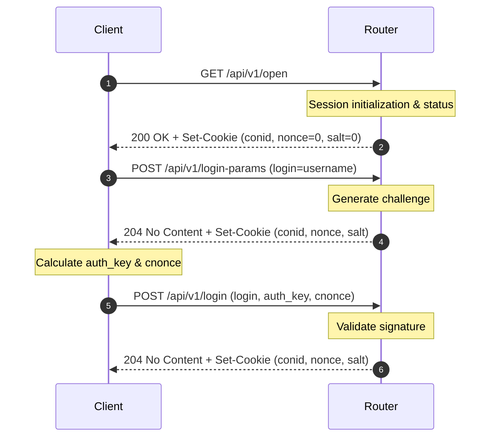

# Sagemcom F@st REST API Login Hashing Algorithm

The Sagemcom routers take steps to avoid passwords being transmitted as cleartext over unencrypted http:// connections. The Sagemcom F@st 5598 (specifically under the YouFibre customized firmware) and most likely similar newer models with the REST-based platform uses a custom challenge-response authentication scheme. This seems to be a progression from the algorithm used with the older JSON-RPC API platforms (`/cgi/json-req`) supported by libraries like `python-sagemcom-api` (see https://github.com/iMicknl/python-sagemcom-api).

This document details the algorithm used to compute the `auth_key` submitted to `/api/v1/login`.

---

## The Authentication Flow

The login process is executed in three main HTTP transactions:

### Session Initialization & Cookies

1. **`GET /api/v1/open`**:
   Before credentials are sent, the client queries this public status endpoint. Along with router metadata, the server returns the following cookies:
   - `conid`: The initial Connection ID (session token).
   - `nonce`: Set to `0` (placeholder).
   - `salt`: Set to `0` (placeholder).
   
2. **`POST /api/v1/login-params`**:
   The client makes a POST request with `login=username` containing the initialized `conid`, `nonce=0`, and `salt=0` cookies in the request header. The router responds with `204 No Content` and overrides these cookies:
   - `conid`: An updated session connection ID.
   - `nonce`: A server-generated cryptographic challenge nonce.
   - `salt`: The cryptographic salt associated with the user.

3. **`POST /api/v1/login`**:
   The client calculates the `auth_key` using the returned `nonce` and `salt`, and posts them along with `cnonce`. The server verifies the credentials and returns a final authenticated `conid` along with updated `nonce` and `salt` for subsequent requests.

---

## Hashing Calculations

The final signature `auth_key` requires four cryptographic steps:

### 1. Password Pre-Hash (SHA-512 Crypt)
The password is first hashed using the iterative UNIX `sha512_crypt` algorithm (standard crypt `$6$`, with default 5000 rounds) using the `salt` retrieved from the `login-params` cookie:

$$\text{crypt\_hash} = \text{sha512\_crypt}(\text{password}, \text{salt})$$

* **Note:** The leading `$6$` algorithm prefix must be stripped from the resulting hash before proceeding to the next step:
  $$\text{znSub} = \text{strings.TrimPrefix}(\text{crypt\_hash}, \text{"\$6\$"})$$
  *(The format of `znSub` becomes `salt$hash`)*

### 2. Credential Hash (`ni`)
An intermediate hash is generated using standard SHA-512 by concatenating the username, the server-supplied nonce, and the stripped crypt hash:

$$\text{ni} = \text{SHA512\_hex}(\text{username} + \text{":"} + \text{nonce} + \text{":"} + \text{znSub})$$

### 3. Client Nonce (`cnonce`)
The client generates a random 19-digit decimal string (`cnonce`), bounded by `1e19`:

$$\text{cnonce} = \text{fmt.Sprintf("\%019d", rand\_uint64 \% 1e19)}$$

### 4. Final Signature (`auth_key`)
The final signature is computed by hashing `ni`, a hardcoded nonce count of `"0"`, and the `cnonce`:

$$\text{auth\_key} = \text{SHA512\_hex}(\text{ni} + \text{":0:"} + \text{cnonce})$$

---

## Test Vectors

The following vectors can be used to verify correctness of the implementation:

* **Username:** `admin`
* **Password:** `some_secure_password`
* **Salt:** `Q9Sn4I/gmeDMa9Z`
* **Nonce:** `88810e86271207f591c8f82aa3f58622`
* **Client Nonce (cnonce):** `6783452008529600000`

### Step Outputs:
1. **SHA-512 Crypt Hash (`crypt_hash`)**: 
   `$6$Q9Sn4I/gmeDMa9Z$m62Gj0S.WuebYLphpSrDGAVdLzAwYjcB5KaKWmKqBfpLE5Z/OUP.jfFVxOaLfmmXUeIFvqT7pttfUen3fWhv8.`
2. **Stripped Crypt Hash (`znSub`)**:
   `Q9Sn4I/gmeDMa9Z$m62Gj0S.WuebYLphpSrDGAVdLzAwYjcB5KaKWmKqBfpLE5Z/OUP.jfFVxOaLfmmXUeIFvqT7pttfUen3fWhv8.`
3. **Credential Hash (`ni`)**:
   `a8519262738b5a338ffdf8fdf192988a8b78bb5dc9051fe62cbea9b47dcc5fae9190887d2e94decc283851d9084ad7f94615c39442f6eca56c456cf522a69037`
4. **Final Auth Key (`auth_key`)**:
   `fe358d2ed9e542365f007fcd535b6e38aa7df83078d3a6daf00258c5f7202b89faad76db956e288bef3ca2175a71a34d1203a7130deaa488129ee4dabbfb94d4`
